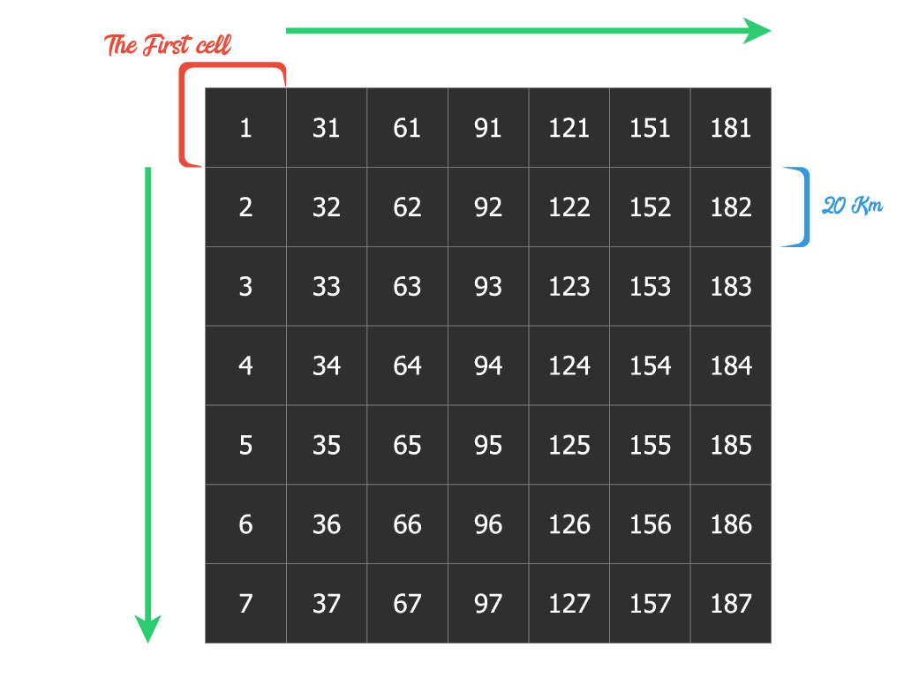
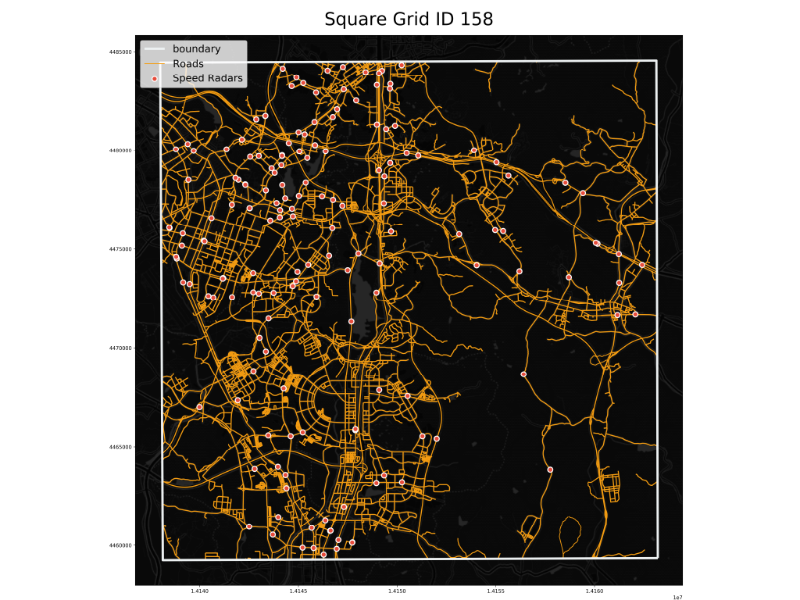

# GIS Programming project #1
A task in the Gis Programming Course
### import Libraries
```py
import os
import geopandas as gpd
from shapely.geometry import Point,Polygon,box
from pyproj import CRS
from numpy import arange
```
### reading "road.shp" File and re-Projecting it to (epsg:5179)
```py
road = gpd.read_file(r"inputs\road.shp",encoding="utf8")
road.to_crs(epsg=5179,inplace=True)
road.head(3)
```
|    |    LINK_ID |     F_NODE |     T_NODE |   LANES |   ROAD_RANK |   ROAD_TYPE | ROAD_NO   | ROAD_NAME   |   ROAD_USE |   MULTI_LINK |   CONNECT |   MAX_SPD |   REST_VEH |   REST_W |   REST_H |   LENGTH | REMARK   | geometry                                                                              |
|---:|-----------:|-----------:|-----------:|--------:|------------:|------------:|:----------|:------------|-----------:|-------------:|----------:|----------:|-----------:|---------:|---------:|---------:|:---------|:--------------------------------------------------------------------------------------|
|  0 | 3880778900 | 3880289100 | 3880289500 |       1 |         107 |         000 | -         | 금오14길    |          0 |            0 |       000 |        40 |          0 |        0 |        0 | 134.264  |          | LINESTRING (1138704.411147075 1703375.173355783, 1138719.404664226 1703508.519328477) |
|  1 | 3880779000 | 3880289500 | 3880289000 |       1 |         107 |         000 | -         | 금오14길    |          0 |            0 |       000 |        40 |          0 |        0 |        0 |  40.1724 |          | LINESTRING (1138719.394230216 1703508.432230688, 1138724.463125565 1703548.259988362) |
|  2 | 3880779100 | 3880289000 | 3880289500 |       1 |         107 |         000 | -         | 금오14길    |          0 |            0 |       000 |        40 |          0 |        0 |        0 |  40.1723 |          | LINESTRING (1138712.566136057 1703549.774121644, 1138707.497141144 1703509.946463892) |

### reading "camera.csv" File
```py
cameras = gpd.read_file(r"inputs\camera.csv",driver="csv",encoding="utf8")
cameras.head(3)
##cameras is a dataframe ↓↓ 
```
|    | ID    | City   |   Direction | Angle   |   Latitude |   Longitude |   Speed Limit |   R_code | geometry   |
|---:|:------|:-------|------------:|:--------|-----------:|------------:|--------------:|---------:|:-----------|
|  0 | F8863 | 수원시 |           3 | W+E     |    37.2659 |     126.957 |            60 |        2 |            |
|  1 | F7559 | 용인시 |           1 | SE      |    37.3217 |     127.08  |            50 |        2 |            |
|  2 | F7569 | 부천시 |           1 | N       |    37.5188 |     126.77  |            30 |        2 |            |

### convert "cameras" to GeoDataFrame
```py
cameras["Longitude"]=cameras["Longitude"].astype(float)
cameras["Latitude"]=cameras["Latitude"].astype(float)
cameras["geometry"]=[Point(xy) for xy in zip(cameras["Longitude"],cameras["Latitude"])]
cameras.crs = CRS.from_epsg(4326).to_wkt() ## cameras is already georeferenced using WGS84
```

### re-projecting cameras to (epsg:5179)
```py
cameras.to_crs(epsg=5179,inplace=True)
cameras.head(3)
```
|    | ID    | City   |   Direction | Angle   |   Latitude |   Longitude |   Speed Limit |   R_code | geometry                                    |
|---:|:------|:-------|------------:|:--------|-----------:|------------:|--------------:|---------:|:--------------------------------------------|
|  0 | F8863 | 수원시 |           3 | W+E     |    37.2659 |     126.957 |            60 |        2 | POINT (951892.9733604998 1918696.861407467) |
|  1 | F7559 | 용인시 |           1 | SE      |    37.3217 |     127.08  |            50 |        2 | POINT (962779.6532611722 1924826.834853379) |
|  2 | F7569 | 부천시 |           1 | N       |    37.5188 |     126.77  |            30 |        2 | POINT (935499.4257011133 1946858.495053298) |

### writing "Sq_Grid" function to create squares grid to cover road
```py
def Sq_Grid(gdf,length,epsg_code):
    cells=list()
    minx,miny,maxx,maxy = gdf.total_bounds
    for x0 in arange(minx,maxx,length):  ##x0 is a minimum x axis to box
        for y1 in arange(maxy,miny,-length):  ##y1 is a maximum y axis to box
            x1=x0+length  ##x1 is a maximum x axis to box
            y0=y1-length  ##y0 is a minimum y axis to box
            cells.append(box(x0,y0,x1,y1))
    return gpd.GeoDataFrame(geometry=cells,crs=CRS.from_epsg(epsg_code))
    

grid = Sq_Grid(road,20000,5179)
grid.head(3)
```
|    | geometry                                                                                                                                                                                            |
|---:|:----------------------------------------------------------------------------------------------------------------------------------------------------------------------------------------------------|
|  0 | POLYGON ((876040.0799623571 2045187.046464815, 876040.0799623571 2065187.046464815, 856040.0799623571 2065187.046464815, 856040.0799623571 2045187.046464815, 876040.0799623571 2045187.046464815)) |
|  1 | POLYGON ((876040.0799623571 2025187.046464815, 876040.0799623571 2045187.046464815, 856040.0799623571 2045187.046464815, 856040.0799623571 2025187.046464815, 876040.0799623571 2025187.046464815)) |
|  2 | POLYGON ((876040.0799623571 2005187.046464815, 876040.0799623571 2025187.046464815, 856040.0799623571 2025187.046464815, 856040.0799623571 2005187.046464815, 876040.0799623571 2005187.046464815)) |

### create "grid_id" column
```py
grid["grid_id"]=[ID for ID in range(1,len(grid)+1)]
grid.head(3)
```
|    | geometry                                                                                                                                                                                            |   grid_id |
|---:|:----------------------------------------------------------------------------------------------------------------------------------------------------------------------------------------------------|----------:|
|  0 | POLYGON ((876040.0799623571 2045187.046464815, 876040.0799623571 2065187.046464815, 856040.0799623571 2065187.046464815, 856040.0799623571 2045187.046464815, 876040.0799623571 2045187.046464815)) |         1 |
|  1 | POLYGON ((876040.0799623571 2025187.046464815, 876040.0799623571 2045187.046464815, 856040.0799623571 2045187.046464815, 856040.0799623571 2025187.046464815, 876040.0799623571 2025187.046464815)) |         2 |
|  2 | POLYGON ((876040.0799623571 2005187.046464815, 876040.0799623571 2025187.046464815, 856040.0799623571 2025187.046464815, 856040.0799623571 2005187.046464815, 876040.0799623571 2005187.046464815)) |         3 |
### Grid Shape
*the start of the grid is top-left square according to the loop in the Sq_Grid function*


### the intersection between road and grid
```py
road_intersection=gpd.overlay(road,grid,how='intersection')
road_intersection.head(3)
## the "grid_id" is create in roads by overlay analysis
```
|    |    LINK_ID |     F_NODE |     T_NODE |   LANES |   ROAD_RANK |   ROAD_TYPE | ROAD_NO   | ROAD_NAME   |   ROAD_USE |   MULTI_LINK |   CONNECT |   MAX_SPD |   REST_VEH |   REST_W |   REST_H |   LENGTH | REMARK   |   grid_id | geometry                                                                              |
|---:|-----------:|-----------:|-----------:|--------:|------------:|------------:|:----------|:------------|-----------:|-------------:|----------:|----------:|-----------:|---------:|---------:|---------:|:---------|----------:|:--------------------------------------------------------------------------------------|
|  0 | 3880778900 | 3880289100 | 3880289500 |       1 |         107 |         000 | -         | 금오14길    |          0 |            0 |       000 |        40 |          0 |        0 |        0 | 134.264  |          |       439 | LINESTRING (1138704.411147075 1703375.173355783, 1138719.404664226 1703508.519328477) |
|  1 | 3880779000 | 3880289500 | 3880289000 |       1 |         107 |         000 | -         | 금오14길    |          0 |            0 |       000 |        40 |          0 |        0 |        0 |  40.1724 |          |       439 | LINESTRING (1138719.394230216 1703508.432230688, 1138724.463125565 1703548.259988362) |
|  2 | 3880779100 | 3880289000 | 3880289500 |       1 |         107 |         000 | -         | 금오14길    |          0 |            0 |       000 |        40 |          0 |        0 |        0 |  40.1723 |          |       439 | LINESTRING (1138712.566136057 1703549.774121644, 1138707.497141144 1703509.946463892) |
### create "grid_id" column in cameras
```py
cameras_grid_id=gpd.sjoin(cameras,grid,how="left",op="within",rsuffix='grid',)

'''
cameras_grid_id.head(3)
```
|    | ID    | City   |   Direction | Angle   |   Latitude |   Longitude |   Speed Limit |   R_code | geometry                                    |   index_grid |   grid_id |
|---:|:------|:-------|------------:|:--------|-----------:|------------:|--------------:|---------:|:--------------------------------------------|-------------:|----------:|
|  0 | F8863 | 수원시 |           3 | W+E     |    37.2659 |     126.957 |            60 |        2 | POINT (951892.9733604998 1918696.861407467) |          127 |       128 |
|  1 | F7559 | 용인시 |           1 | SE      |    37.3217 |     127.08  |            50 |        2 | POINT (962779.6532611722 1924826.834853379) |          157 |       158 |
|  2 | F7569 | 부천시 |           1 | N       |    37.5188 |     126.77  |            30 |        2 | POINT (935499.4257011133 1946858.495053298) |           95 |        96 |
### create grid boundary
```py
grid["geometry"] = grid["geometry"].boundary
grid.head(3)
```
|    | geometry                                                                                                                                                                                             |   grid_id |
|---:|:-----------------------------------------------------------------------------------------------------------------------------------------------------------------------------------------------------|----------:|
|  0 | LINESTRING (876040.0799623571 2045187.046464815, 876040.0799623571 2065187.046464815, 856040.0799623571 2065187.046464815, 856040.0799623571 2045187.046464815, 876040.0799623571 2045187.046464815) |         1 |
|  1 | LINESTRING (876040.0799623571 2025187.046464815, 876040.0799623571 2045187.046464815, 856040.0799623571 2045187.046464815, 856040.0799623571 2025187.046464815, 876040.0799623571 2025187.046464815) |         2 |
|  2 | LINESTRING (876040.0799623571 2005187.046464815, 876040.0799623571 2025187.046464815, 856040.0799623571 2025187.046464815, 856040.0799623571 2005187.046464815, 876040.0799623571 2005187.046464815) |         3 |
### create otuputs directory
```py
path = os.path.join(os.getcwd(),"otuputs")
os.mkdir(path)
```

### create boundary,cameras and roads geojson files in otuputs dir
```py
for ID in grid["grid_id"]:
    os.mkdir(os.path.join("otuputs",str(ID)))
    grid[grid["grid_id"]==ID].to_file(os.path.join("otuputs",str(ID),"boundary.geojson"),driver="GeoJSON")
    if (cameras_grid_id[cameras_grid_id["grid_id"]==ID].empty):
        open(os.path.join("otuputs",str(ID),"cameras.geojson"),"x")
    else:
        cameras_grid_id[cameras_grid_id["grid_id"]==ID].to_file(os.path.join("otuputs",str(ID),"cameras.geojson"),driver="GeoJSON",encoding="utf-8")
    
    if (road_intersection[road_intersection["grid_id"]==ID].empty):
        open(os.path.join("otuputs",str(ID),"roads.geojson"),"x")
    else:
        road_intersection[road_intersection["grid_id"]==ID].to_file(os.path.join("otuputs",str(ID),"roads.geojson"),driver="GeoJSON",encoding="utf-8")
```
### the files in 158 dir


### Speed Radars Location on Roads in Square 158


### to explore ineractive map [https://speedradars.netlify.app](https://speedradars.netlify.app)

```py
## yasser Ismail
```
